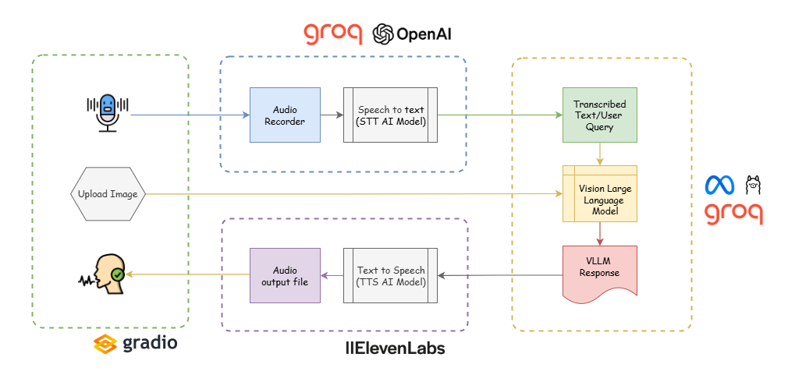

# MediBot: AI Doctor with Vision and Voice


## Overview
**MediBot** is an AI-driven virtual medical assistant that leverages **Vision-Language Models (VLLM)**, **speech recognition**, and **text-to-speech synthesis** to provide **real-time medical insights**. By integrating **multimodal AI capabilities**, MediBot enhances **patient-doctor interactions**, offering intelligent medical assistance through **voice and image-based diagnostics**. 

This project aims to provide **an accessible, AI-powered healthcare assistant** that can analyze **medical images**, understand **spoken symptoms**, and generate **human-like medical responses** to assist patients and doctors in preliminary diagnostics.

## Key Features
- **Multimodal AI Analysis**: Uses **VLLM (Vision-Language Learning Models)**, particularly **LLaMA-3.2-11B-Vision**, to process both **medical images** and **text-based queries**.
- **Speech Recognition**: Converts spoken patient queries into text using **Whisper-large-v3**.
- **Text-to-Speech Synthesis**: Generates lifelike responses using **ElevenLabs** or **gTTS**.
- **Advanced Natural Language Understanding**: LLaMA models are optimized to generate **contextually aware** medical responses.
- **Interactive User Interface**: Built with **Gradio** for an intuitive, seamless user experience.

## Technologies Used
- **Machine Learning Framework**: vLLM for **low-latency inference**.
- **Vision-Language Model (VLM)**: LLaMA-3.2-11B-Vision.
- **Speech-to-Text (STT)**: OpenAI Whisper-large-v3.
- **Text-to-Speech (TTS)**: ElevenLabs API, gTTS.
- **Image Processing**: Base64 encoding for efficient transmission.
- **Frontend**: Gradio-based Web UI.

## Workflow Diagram
Below is a visual representation of how **MediBot** processes user inputs and generates medical insights:


## Installation & Setup
### 1. Clone the repository
```bash
git clone https://github.com/rakibnsajib/MediBot-AI-Doctor-with-Vision-and-Voice.git
cd MediBot-AI-Doctor-with-Vision-and-Voice
```

### 2. Install Dependencies
```bash
pip install -r requirements.txt
```

### 3. Set Up API Keys
Create a `.env` file in the root directory and add your API keys:
```env
GROQ_API_KEY=your-groq-api-key
ELEVENLABS_API_KEY=your-elevenlabs-api-key
```
Then, load the environment variables in your code using:
```python
from dotenv import load_dotenv
import os

load_dotenv()
GROQ_API_KEY = os.getenv("GROQ_API_KEY")
ELEVENLABS_API_KEY = os.getenv("ELEVENLABS_API_KEY")
```

### 4. Install FFmpeg and PortAudio

#### macOS
1. **Install Homebrew** (if not already installed):
   ```bash
   /bin/bash -c "$(curl -fsSL https://raw.githubusercontent.com/Homebrew/install/HEAD/install.sh)"
   ```
2. **Install FFmpeg and PortAudio:**
   ```bash
   brew install ffmpeg portaudio
   ```

#### Linux
For Debian-based distributions (e.g., Ubuntu):
1. **Update the package list**
   ```bash
   sudo apt update
   ```
2. **Install FFmpeg and PortAudio:**
   ```bash
   sudo apt install ffmpeg portaudio19-dev
   ```

#### Windows
##### Download FFmpeg:
1. Visit the official FFmpeg download page: [FFmpeg Downloads](https://ffmpeg.org/download.html)
2. Navigate to the Windows builds section and download the latest static build.

##### Extract and Set Up FFmpeg:
1. Extract the downloaded ZIP file to a folder (e.g., `C:\ffmpeg`).
2. Add the `bin` directory to your system's PATH:
   - Search for "Environment Variables" in the Start menu.
   - Click on "Edit the system environment variables."
   - In the System Properties window, click on "Environment Variables."
   - Under "System variables," select the "Path" variable and click "Edit."
   - Click "New" and add the path to the `bin` directory (e.g., `C:\ffmpeg\bin`).
   - Click "OK" to apply the changes.

##### Install PortAudio:
1. Download the PortAudio binaries from the official website: [PortAudio Downloads](http://www.portaudio.com/download.html)
2. Follow the installation instructions provided on the website.

### 5. Run the Application
```bash
python main.py
````

## Usage Guide
1. **Upload an image** of the affected area.
2. **Record your voice** describing the symptoms.
3. **Receive AI-generated medical insights** in **text** and **voice format**.
4. **Interact with the AI Doctor** via **natural language queries** powered by **LLaMA-3.2-11B-Vision**.


## Future Enhancements
- **Expanded Medical Condition Coverage**: Train models on broader datasets for **more accurate diagnostics**.
- **Integration with EHR Systems**: Enable seamless data exchange with **electronic health records**.
- **Support for Multilingual Consultation**: Improve accessibility for **non-English speakers**.
- **Edge AI Optimization**: Optimize performance for **low-power devices** to enable **remote diagnostics**.
- **Personalized AI Assistance**: Adapt responses based on **patient history and past interactions**.


## Licensing & Compliance
- This project is licensed under the **MIT License**.

